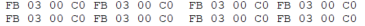
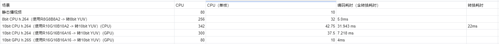

[TOC]

# HDR推流方案

导语
HDR 指的是高动态范围（High dynamic range），对应的显示技术是 SDR（标准动态范围，Standard dynamic range），其中 HDR 更接近于人眼的视觉效果，能够同时呈现更丰富的亮部细节和暗部细节，极大提升视觉体验。


## 一、HDR简介

HDR”是英文“High Dynamic Range”的缩写，中文意思是“高动态范围”，“动态范围”是指图像中“最亮的点”和“最暗的点”之间的灰度等级数量。动态范围越大，图像中的亮度、对比度范围就越大。相比普通的画像，HDR技术可以使得画面中的暗部表现更为深邃但是不丢失细节，对亮部进行合理的曝光调整，增加细节，提升亮度表现，从而可以提供更多的动态方位和图像细节，能够更好的反映出真实环境中的视觉效果。 “HDR”简要的说就是一种提高影像亮度、对比度范围的处理技术。HDR技术是视频领域的一场技术革命，将极大提升视觉体验。4K的核心在于增加像素数，而HDR是让像素显示变得更好。

HDR技术一般应用于摄影、视频、游戏


作为面向下一代的高质量成像技术，但因为标准方面的问题、电子制造商的支持、生产成本以及改进内容的难度和广播成本等问题，HDR一直以来面临片源不足，普及度有限等问题，使得HDR内容少之又少，HDR技术在前几年发展都得都相对缓慢，但从去年开始HDR技术发展快了起来。

2020年3月，腾讯视频推出基于HDR技术的“臻彩视听”功能，持续升级用户视听体验。
2020年9月30日，B 站宣布启动 “HDR 真彩”画质升级，支持 HDR10 高色彩、4K 高分辨率、120 高帧率画质的在线视频。
2020年10月14日，苹果宣布全新的iPhone 12 Pro支持10bit HDR视频的拍摄，并且从拍摄到剪辑全面支持杜比视界。
2020年11月06日，微博现已支持 HDR 视频，iPhone 12 可直接上传
2020年12月09日，Youtube宣布支持HDR视频内容直播，虽然早在2016年，Youtube就添加了添加了对 HDR视频的支持。
2020年12月10日，王者荣耀表示新版本使用次世代 PBR2.0 渲染技术与 HDR 渲染技术，打造峡谷的极致光影、明快色彩。

播放平台不断支持HDR技术，但是内容产出方依赖需要专业的软件和技术，离普通用户较远。现在的游戏大作普遍都HDR，直播作为离线视频领域的延展，市面上鲜有HDR的直播工具，作为主播即使你有HDR内容，你也没办法把HDR的真正效果传递给普通用户。因为当前直播都是SDR，你会明显感觉到直播非常暗淡灰暗，HDR将解决这一问题。
如下面是一个大作赛博朋克2077的一处SDR与HDR场景效果对比，不少人感慨有HDR和没有HDR是两个游戏。


本文将介绍如何基于当前8bit的直播工具基础，实现一款HDR游戏录制及直播工具，并进行正确的播放。

## 二、HDR的关键参数指标
#### 1、HDR的几个关键指标

分辨率：3820×2160
色深：10bit
色域：BT.2020
PQ（电光转换函数）:  ST2084
亮度范围：0.01~1000nit

其中分辨率是推荐4K分辨率，对于直播而言并非强制要求，此外当前民用HDR显示器一般也达不到1000nit。

可以使用VLC查看HDR视频信息


#### 2、几个关键数据格式
##### a、R8G8B8A8
|  color|FFMPEG | DX  | LIBYUV   | obs   |
|  :--: |:--:  | :--:  |  :--:    |:--: |:--: |
| RGBA|   AV_PIX_FMT_RGBA  | DXGI_FORMAT_R8G8B8A8_UNORM |	ABGR |	GS_RGBA|
红色 RGBA = FF 00 00 FF


|  data|R | G  |  B   | A   |
| --- | --- | --- | --- | --- |
| index|   buf[0]  |  buf[1]  |buf[2]	|	buf[3]|
| bit|  1~8   |  9~16  |17~24	|	25~32|
| data|   FF  |  00 |00	|	FF|


|  memory | A | B  |  G   | R   |
| --- | --- | --- | --- | --- |
| bit |  25~32  | 17~24	  |9~16| 1~8	|
| data|   FF  |  00 |00	|	FF|
红色 RGBA = FF 00 00 FF

##### b、R10G10B10A2
R10G10B10A2是HDR的标准渲染格式

|  color|FFMPEG | DX  | LIBYUV   | obs   |
| --- | --- | --- | --- | --- |
| R10G10B10A2|   -  | DXGI_FORMAT_R10G10B10A2_UNORM |	AR30|	GS_R10G10B10A2 |

红色AR30 = FF 03 00 C0
C0 = 11000000
03 FF = 1023
|  data|R | G  |  B   | A   |
| --- | --- | --- | --- | --- |
| bit|  1~10   |  11~20  |20~30	|	31~32|
| data|  11 1111 1111   |  00 0000 0000	  |00 0000 0000 	|	11 |

|  memory | A | B  |  G   | R   |
|  :--: |:--:  | :--:  |  :--:  |:--: |:--: |
| bit |  1~2  | 3~12	|13~22 | 23~32	|
| data|  11  |  00 0000 0000 |00 0000 0000	|	11 1111 1111|



##### c、YUV I420 10bit

|  color|FFMPEG | DX  | LIBYUV   | obs   |
| --- | --- | --- | --- | --- |
| yuv10bit|   AV_PIX_FMT_YUV420P10LE  | DXGI_FORMAT_P010 |	U010|	VIDEO_FORMAT_YUV420P10LE |

存储


每个像素依然占用16bit两个字节，但是其中6个bit是padding，补0。

RGBA				  4*width*height
YUV420P8BIT   1.5*width*height
YUV420P10BIT  3*width*height

对应还有YUV的 NV12 10bit，类比8bit I420和NV12。
此外还有RGBA16，类比R8G8B8A8，即每个人通道占16bit。
还有YUVX格式，类比RGBA，即YUV依次排列的数据。

几种格式的内存分配


#### 3、ffmpeg HDR关键数据参数

-color_primaries 9  // BT.2020
-color_trc 16 // SMTE2084
-colorspace 9 // BT2020_NCL
-color_range // 1

## 三、HDR游戏直播改造

如果你对传统8bit直播有一定了解，知道一般直播分为采集、画面渲染合成、纹理处理、编码、推流、拉流播放等过程。

要支持HDR游戏直播，基本这些每个过程都需要经过改造。

改造之前说一些准备工作
1、WIN10系统版本必须在1709版本以上
2、一款支持HDR的显示器，原则上支持1000nit以上最好，如果没有可以折中购买600nit或者400nit，最好是displayHDR认证的
3、在你的直播助手底层支持四种格式的数据传输


#### 1、采集
NVIDIA 输出颜色深度调为10bpc，输出动态范围调整为完全，建议驱动更新到最新版。
显示器，系统都开启HDR，同时把游戏的HDR打开。

采集游戏源，hook游戏，使用共享纹理绘制上画布。游戏纹理一般为R10G10B10A2。

#### 2、画面渲染合成
没有设置正确的渲染参数，在画布上预览的结果将是错误的，需要设置正确参数。
a、设置色域
```
	IDXGISwapChain3_SetColorSpace1(DXGI_COLOR_SPACE_RGB_FULL_G2084_NONE_P2020)
```
b、设置HDR metadata
```
    DXGI_HDR_METADATA_HDR10 hdr10 = {0};
    hdr10.GreenPrimary[0] = 13250;
    hdr10.GreenPrimary[1] = 34500;
    hdr10.BluePrimary[0] = 7500;
    hdr10.BluePrimary[1] = 300;
    hdr10.RedPrimary[0] = 34000;
    hdr10.RedPrimary[1] = 16000;
    hdr10.WhitePoint[0] = 15635;
    hdr10.WhitePoint[1] = 16450;
    hdr10.MinMasteringLuminance = 100;
    hdr10.MaxMasteringLuminance = 6000000;
    hdr10.MaxContentLightLevel = 6000000;
    hdr10.MaxFrameAverageLightLevel = 6000000;
    IDXGISwapChain4_SetHDRMetaData->SetHDRMetaData(DXGI_HDR_METADATA_TYPE_HDR10, sizeof(hdr10), &hdr10);
```

使用上面接口都需要先校验接口是否支持

D3D12实现HDR较为简单，参考微软demo即可实现
D3D11官方推荐方法使用DirectXTK拓展，实际使用拓展并方便，这边参考vlc实现在D3D11下实现HDR渲染。
主要步骤通过 IDXGISwapChain的QueryInterface获取兼容IDXGISwapChain3接口和IDXGISwapChain4，再调用上述接口
#### 3、纹理处理
当画面渲染合成完成后，有两种方法对纹理进行处理，分别CPU转换和GPU转换，实际工作一般使用GPU，但为了验证调试结果，我也实现了CPU处理方案。

a、CPU转换方案
目前并没有完整的对R10G10B10A2转YUV10bit这种格式的开源实现，我参考skia和libyuv源码实现了一套R10G10B10A2和YUV10bit互转方案，即将R10G10B10A2纹理数据下载下来，然后使用C方案对各个像素转换。
代码如下

自研实现的YUV10bit转R10G10B10A2 CPU版本

YUV转R10G10B10A2


R10G10B10A2转YUV


a、GPU转换方案
经实验验证，CPU方案每帧转换花费20ms，由于数据不对齐的问题，并没有很好的指令集加速的方法，下面介绍GPU转换方案。

将R10G10B10A2纹理上转换到R16G16B16A16格式纹理上，转成Y16U16V16X16格式，再使用GPU重排可得YUV10bit

矩阵转换

得Y16U16V16X16


重排


#### 4、编码
接下来主要前面提到的HDR参数进行编码

a、CPU软编H.264 （x264） 
需要注意，你使用某个版本x264可能有bug，导致无法进行10bit编码，错误代码如下，错误原因是将一个无符号负数和0对比，导致走了错误路径。

需要改为

x264 参数设置


需要注意H.264标准中没有对master display和content light info支持，意味x264只能实现一个不完整HDR。如果需要支持，只能基于SEI实现一个定制版本的HDR。

b、CPU软编H.265（x265）


c、硬编 H.265（hevc_nvenc）
设置，需要注意AV_PIX_FMT_P010LE其实并不是标准的YUV10bit，而是YUV16bit。


几种方案的性能对比


#### 5、hevc_nvenc HDR  metadata支持
x265性能太过糟糕，最终我们选中硬编 H.265方案，H.265标准中有对master display和content light info支持，x265实现了，但是硬编H.265中也没有对HDR metadata支持，当前ffmpeg最新版本（截止2020.12.31）已没有对该特性进行支持。

经过对ffmpeg源码中HDR相关模块源码的阅读，我参考x265，在hevc_nvenc中支持了HDR metadata的支持，并给ffmpeg提了一个patch。

命令行如下，给一个无HDR metadata的HDR视频添加HDR metadata。
```
ffmpeg -i HDR_X265_master2.mp4 -vcodec hevc_nvenc -bsf:v hevc_metadata=transfer_characteristics=16:colour_primaries=9:video_full_range_flag=0:matrix_coefficients=9:max_cll="1000|1000":master_display="G(13250|34500)B(7500|3000)R(34000|16000)WP(15635|16450)L(10000000|100)" with_sei_video_265.mp4 -y
```
HDR metadata是有两个SEI存储的，分别对应类型为CONTENT_LIGHT_LEVEL_INFO（144）和MASTERING_DISPLAY_INFO（137）
利用AVBitStreamFilter滤镜，对硬编出来的包添加了这两个SEI。

#### 6、推流
云端需要转HDR流和SDR流

#### 7、拉流
ffmpeg不支持hevc的拉流，首先需要参考网上方案实现ffmpeg hevc拉流。

#### 8、播放

这里分为两种情况，有HDR显示器播放HDR流和没有HDR显示器播放HDR流。
a、有HDR显示器播放HDR流
有HDR显示器，再ffmpeg解包之后，参考2中的方法设置正确的色域和HDR metadata即可使用DX11正确上屏。
b、没有HDR显示器播放HDR流
没有HDR显示器播放HDR流，需要增加一个HDR转SDR的过程，该过程叫色调映射（tone map），同样有两种方案。
1）CPU转换

需要zscale滤镜，zscale需要zimg和z.lib
```
#define CONFIG_ZSCALE_FILTER 1
#define CONFIG_LIBZIMG 1
```
拉流播放
```
ffplay.exe -color_primaries 9 -color_trc 16 -colorspace 9 -color_range 1 -i "rtmp://139.199.158.246/live/4004_1649765?ip=9.11.40.73&port=97" -vf zscale=t=linear:npl=100,format=gbrpf32le,zscale=p=bt709,tonemap=tonemap=hable:desat=0,zscale=t=bt709:m=bt709:r=tv,format=yuv420p,zscale=s=1920x1080
```

2）GPU转换


#### 7、离线HDR视频转码


a、H.264
x264转码
```
ffmpeg -i HDR.webm -b:v 18000000 -pix_fmt yuv420p10le -color_primaries 9 -color_trc 16 -colorspace 9 -color_range 1 -maxrate 26800000 -minrate 8040000 -profile:v 2 -vcodec libx264 HDR_x264.mp4 -y
```
x264会丢失以下信息


硬编不支持10bit 264编码
b、H.265
x265转码
```
ffmpeg -i HDR.webm -b:v 18000000 -pix_fmt yuv420p10le -color_primaries 9 -color_trc 16 -colorspace 9 -color_range 1 -maxrate 26800000 -minrate 8040000 -profile:v 2 -vcodec libx265   -x265-params -master-display="G(13250,34500)B(7500,3000)R(34000,16000)WP(15635,16450)L(10000000,100)"  HDR_x265_with_display.mp4 -y
```

G(13250,34500)B(7500,3000)R(34000,16000)WP(15635,16450)，等参数一般为固定值；
--max-cll "****,****" 中的 ****,**** 需根据实际改为原视频对应参数
“L”控制显示亮度参数设置案列如下(需根据实际改为原视频对应参数):
当其中命令参数为 L(10000000,50)  读取显示参数为 min: 0.0050 cd/m2, max: 1000.0000 cd/m2  
当其中命令参数为 L(12000000,500) 读取显示参数为 min: 0.0500 cd/m2, max: 1200.0000 cd/m2
硬编hevc_h265
```
ffmpeg -i HDR.webm -vcodec hevc_nvenc -acodec aac HDR_HEVC.MP4
```

2）HDR转SDR
```
ffmpeg.exe -i HDR_264.MP4 -vf zscale=t=linear:npl=100,format=gbrpf32le,zscale=p=bt709,tonemap=tonemap=hable:desat=0,zscale=t=bt709:m=bt709:r=tv,format=yuv420p,zscale=s=1920x1080 -c:v libx265 -preset slow -crf 18 -c:a copy hdr_onsdr.mp4
```

## 四、性能数据对比
使用4核i7-6700 @3.40GHz 机器

直播编码 30FPS 1080P 8000码率 
#### 1、性能消耗
##### a、CPU软编（x264）数据
x264参数 
rate_control ：CRF
vbv-maxrate ：8000 / vbv-bufsize=8000 
gop ： 90
preset：veryfast

| bit|  8bit x264  | 10bit x264|	
|  :--: |:--:  | :--:  |  
| CPU|  22%  |27.5%|	
| 耗时|  5ms  |7.2ms|
得出 10bit 编码较 8bit编码 大约多需要花25%的CPU
##### b、硬编265（hevc_nvenc）
GPU消耗
hevc_nvenc参数
rate_control: CBR
bitrate:      6400
cqp:          0
keyint:       90
preset:       default
level:        auto
2-pass:       true
b-frames:     0

| bit|  8bit 265| 10bit 265|	
|  :--: |:--:  | :--:  |  
| GPU（encoder模块）|  13%  |15%|	
| 耗时|  1ms |5.2ms|
得出 10bit 编码较 8bit编码 大约多需要花15%的GPU

#### 2、码率消耗
使用ffmpeg对一个谷歌离线视频（1080P 24FPS ）进行转码实验 
##### a、软编264（x264）数据

	ffmpeg -i HDR.webm -c:v libx264 -preset veryfast -crf 18 X264_SDR.MP4

| bit|  8bit x264  | 10bit x264|	
|  :--: |:--:  | :--:  |  
| 文件大小|  50713 KB |43449KB|	
得出 10bit 编码较 8bit编码 文件体积小大约14.3%
##### b、硬编265（hevc_nvenc）

	ffmpeg -i HDR.webm -vcodec hevc_nvenc -qp 22 HEVC_NVENC_HDR.MP4


| bit|  8bit x264  | 10bit x264|	
|  :--: |:--:  | :--:  |  
| 文件大小|  38689KB|34078KB|	
得出 10bit 编码较 8bit编码 文件体积小大约11.9%

无论软编264还是硬编265，虽然直观上感觉10bit比8bit多占用25%的数据量，但实际上在实践中10bit往往能带来更高的压缩率。这是由于10bit更能准确地描述颜色，提升了信噪比。例如为了解决banding，8bit编码技术可以通过一种称为dither（抖动）的方法，也就是在色块边缘混入细碎的相邻色的色点，来模糊色块边缘。但是由于这些色点的存在大幅提高了画面的复杂度，产生了许多冗余信息量。由于8bit必须采用这些技术来提高视觉观感，所以8bit编码往往要引入大量冗余信息，而10bit不需要dither也能实现一样的画面感受，所以往往10bit编码出来的视频大小小于同等质量的8bit视频。


结论：
**1、使用软编264方案，10bit 编码较 8bit编码 大约多需要花25%的CPU，码率越小14.3%**
**2、使用硬编265方案，10bit 编码较 8bit编码 大约多需要花15%的CPU，码率越小11.9%**

## 五、腾讯云支持情况
1、264原始流播放无问题，264转码流错误，表现为丢失色阶色域信息
2、265原始流播放无问题，264转码流严重错误，表现为画面完全崩塌


## 六、遗留问题
1、obs的开源问题
2、h.265的专利收费问题


