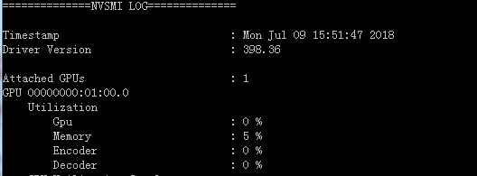

[TOC]

# 显卡硬编消耗

本文主要解决以下问题
1、之前有对显卡整体GPU和显存利用率监控，没有对显卡硬编消耗作监控。
2、游戏自身是否卡顿无法判别。

## nvidia-smi && nvml介绍
GPU-Z只可以获取显卡整体GPU与显存的利用率，无法获得编码消耗。

#### nvidia-smi
nvidia-smi是英伟达提供的基于NVIDIA Management Library （NVIDIA管理库）的一个工具，可以实现NVIDIA GPU设备的管理和监控功能。该工具会随着驱动程序不断更新，一般在C:\Program Files\NVIDIA Corporation\NVSMI目录下可以找到该工具。
通过nvidia-smi可以获得Gpu，Memory（显存），Encoder（显卡编码器），Decoder（显卡解码器）消耗。
$ nvidia-smi -i 0 -q -d UTILIZATION

#### nvml
nvml是一个nvidia-smi可供编程的动态库，目前仅提供64位。该动态库也会随着驱动程序不断更新。

## 显卡资源消耗测试
基于上述工具，我们可以对直播中的显卡硬件资源消耗进行一系列测试。

#### 电脑配置
显卡：1050TI
CPU：i7-6700 @3.4GHZ
内存：16GB

#### 推流不变参数
FPS：30 
分辨率：1920X1080

#### 准备画面
（1）纯黑画面
（2）静止图片
（3）hook方式采集绝地求生中等画质
（4）显示器方式采集绝地求生中等画质
（5）英雄联盟

### 显卡消耗

#### 未开启游戏消耗 
| 直播内容| GPU| memory |FPS|游戏进程CPU| 
| --- | --- | --- | --- | --- |
| 电脑|   0|5|  -| -|

#### 仅开启游戏的消耗
| 直播内容| GPU| memory |CPU|FPS|
| --- | --- | --- | --- | --- |
| pubg中等画质| 97|60|-|60|
| 英雄联盟|    0|4|18|140|

#### 开启hook采集的消耗
| 直播内容| GPU| memory |FPS|游戏进程CPU|
| --- | --- | --- | --- | --- |
| pubg|   97|55|  60| -|
| 英雄联盟|  5|8| 120|18|

#### 开启显示器采集的消耗
| 直播内容| GPU| memory |FPS|游戏进程CPU|
| --- | --- | --- | --- | --- |
| pubg|   42|22|  20-25| -|

#### 硬编265-码率3000
| 直播内容| GPU| encoder|memory |FPS|
| --- | --- | --- | --- | --- |
| 空|   1|  13|  1|-|
| 静态图片|  2|  11|  2|-|
| 吃鸡hook|   96|  10|  53|50|false|
| 吃鸡显示器|   40|  8|  17|20|false|
| 英雄联盟hook|   3|  12| 2 |100|

#### 硬编265-码率6000
| 直播内容| GPU| encoder|memory |FPS|
| --- | --- | --- | --- | --- |
| 空|   2|  12|  2|-|
| 静态图片|  2|  11|  2|-|
| 吃鸡hook|   96|  11|  50|50|false|
| 吃鸡显示器|   40|  8|  15|20|false|
| 英雄联盟hook|   2|12 | 2|100|

#### 硬编264-码率3000
| 直播内容| GPU| encoder|memory |FPS|
| --- | --- | --- | --- | --- |
| 空|   2|  14|  2|-|
| 静态图片|  2|  14|  2|-|
| 吃鸡hook|   93|  11|  57|50|false|
| 吃鸡显示器|   36|  12|  21|18|false|
| 英雄联盟hook|   3|  15|  2|100|

#### 硬编264-码率6000

| 直播内容 | GPU | encoder | memory | FPS |
| --- | --- | --- | --- | --- |
| 空|   2|  14|  2|-|
| 静态图片|  2|  14|  2|-|
| 吃鸡hook|   94|  12|  45|50|
| 吃鸡显示器|   50|  12|  25|18|
| 英雄联盟hook|   3|  12|  2|100|

## 分析及结论
（1）由encoder一列得出，显卡硬编消耗显卡编码器不大。
（2）由四个数据对比，码率对编码器消耗影响不大。
（3）使用显示器捕获吃鸡会大幅下降GPU和GPU memory的使用率，导致卡顿。

## 后续思考
（1）当前编码器分布中，硬编265约占50%，软编264约占45%，硬编264约占5%。
由于我们没有对硬编264进行推荐，当前主播显卡一般都不错，后面可以加大推荐
（2）能用hook的就不要用截屏和窗口。
（3）nvapi方式监控GPU可能获取不到GPU参数；而nvml仅支持64位，需要做一个中间层，实现GPU监控效果如下。
（4）一般地，当吃鸡主播GPU和memory同时大幅下降，出现卡顿的概率较高。判别游戏自身是否卡顿需要酌情分析。

